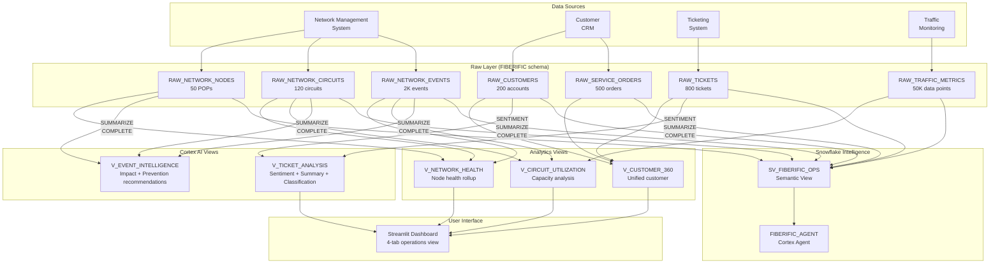

# Fiberific Data Flow

```mermaid
flowchart TD
    subgraph Sources["Data Sources"]
        NMS["Network Management\nSystem"]
        CRM["Customer\nCRM"]
        TKT["Ticketing\nSystem"]
        MON["Traffic\nMonitoring"]
    end

    subgraph Raw["Raw Layer (FIBERIFIC schema)"]
        N["RAW_NETWORK_NODES\n50 POPs"]
        C["RAW_NETWORK_CIRCUITS\n120 circuits"]
        E["RAW_NETWORK_EVENTS\n2K events"]
        CU["RAW_CUSTOMERS\n200 accounts"]
        SO["RAW_SERVICE_ORDERS\n500 orders"]
        T["RAW_TICKETS\n800 tickets"]
        TM["RAW_TRAFFIC_METRICS\n50K data points"]
    end

    subgraph Analytics["Analytics Views"]
        VNH["V_NETWORK_HEALTH\nNode health rollup"]
        VCU["V_CIRCUIT_UTILIZATION\nCapacity analysis"]
        VC3["V_CUSTOMER_360\nUnified customer"]
    end

    subgraph AI["Cortex AI Views"]
        VTA["V_TICKET_ANALYSIS\nSentiment + Summary + Classification"]
        VEI["V_EVENT_INTELLIGENCE\nImpact + Prevention recommendations"]
    end

    subgraph Intelligence["Snowflake Intelligence"]
        SV["SV_FIBERIFIC_OPS\nSemantic View"]
        AG["FIBERIFIC_AGENT\nCortex Agent"]
    end

    subgraph UI["User Interface"]
        ST["Streamlit Dashboard\n4-tab operations view"]
    end

    NMS --> N & C & E
    CRM --> CU & SO
    TKT --> T
    MON --> TM

    N & E & C --> VNH
    C & TM & E --> VCU
    CU & SO & T --> VC3

    T & CU -->|"SENTIMENT\nSUMMARIZE\nCOMPLETE"| VTA
    E & N & C -->|"SUMMARIZE\nCOMPLETE"| VEI

    N & C & E & CU & SO & T & TM --> SV
    SV --> AG

    VNH & VCU & VC3 & VTA --> ST
```
